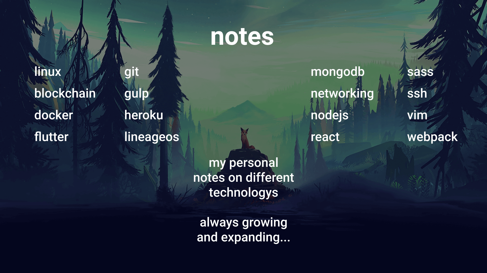

# Notes

My Notes regarding different Technologys and Basics to turn into guides.
Each file is named in the subdirectories is names "README" so it gets displayed on git.

## Content

[blockchain](./blockchain)

[docker](./docker)

[flutter](./flutter)

[git](./git)

[gulp](./gulp)

[heroku](./heroku)

[lineageos](./lineageos)

[linux](./linux)

[mongodb](./mongodb)

[networking](./networking)

[nodejs](./nodejs)

[react](./react)

[sass](./sass)

[ssh](./ssh)

[vim](./vim)

[webpack](./webpack)

[zsh](./zsh)

TODO: Refactoring all old .txt as .md and add/delete where necessary